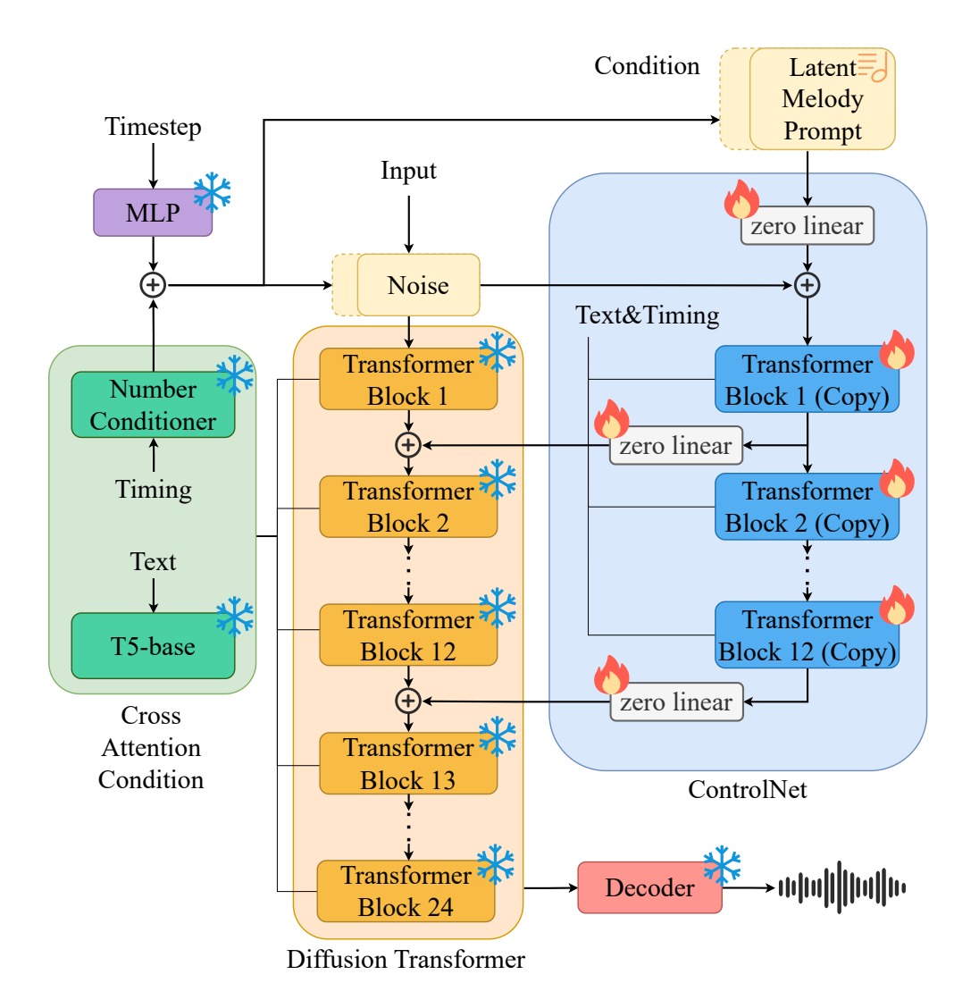

16.Jan.25

## 架构

DiT(+ControlNet)

## 特点

ControlNet

希望增强模型，但是不希望微调模型使得其丧失能力的一种思路：分支+注意力注入+冻结主干

CQT表示

## 笔记

### 任务描述

TTM（Text-to-Music），仅用文本提示生成音乐

Music Editing / Music Style Transfer，文本提示加旋律提示编辑音乐 

$$
\text{(文本提示，可选旋律提示，可选时长) -> 44.1kHz立体声音乐}
$$

### 输入处理与表示，CQT

1. 文本输入使用 T5-base 编码，通过交叉注意力注入 DiT

>   T5-base

    Text-to-Text Transfer Transformer（Google，文本条件编码器）。

2. 旋律提示从音频到 CQT 转换。旋律提示的最原始状态不一定是音频，旋律提示的构造可以来自：

- 音频：计算 top-k CQT 得到音高索引
- 乐谱：音高序列转索引
- 人工：人工手动编写音高序列转索引

>   CQT

    1. 对 44.1kHz 立体声音频，左右声道分别计算 CQT；
    2. CQT 使用 128 个 bin，对应 128 个 MIDI 音高，中心频率指数分布，贴合音乐音阶；
    3. 对每一帧、每个声道，用 argmax 保留 top-4 最显著音高；
    4. 左右声道各 4 个，交错堆叠成：
    $$
    \boldsymbol{c} \in \mathbb{R}^{8\times T f_k}
    $$
    其中每个元素是 1 到 128 的音高索引；
    5. 计算 CQT 前，先加一个截止在 Middle C（261.2 Hz）的双二次高通滤波器；
    6. 然后通过 pitch-specific trainable embedding 把离散音高索引变成高维向量；
    7. 再用 1D 卷积层下采样，对齐到 ControlNet 的输入形状，得到 latent melody prompt。

    这样做的优点：
    - 保留绝对音高，不局限在单八度；
    - 能表示多轨、多八度、宽音域旋律；
    - 比 chroma 更精确，避免只记录最显著 pitch class 导致的信息丢失；
    - 仍然保持人类可理解的音高索引形式，可从音频、乐谱或手工构造。

3. 时长，时序条件

- 时长：显示指定的时长
- 时序：扩散的时间步 t（timestep）

>   为什么是44.1kHz

    DiT 直接移植了 StableAudio Open 的预训练主干。其编解码器等处理的是 44.1 kHz 音频。输入并非是 44.1kHz，但是需要重采样。

### 训练流程

1. **条件注入方式** ：

Text & Timing：（1）交叉注意力直接注入 DiT；（2）交叉注意力注入 ControlNet 后使用 zero linear 处理后加法注入 DiT

Melody：作为输入使用 zero linear 处理后进入 ControlNet，随后使用 zero linear 处理后加法注入 DiT

>   zero linear

    zero-initialized linear layer（零初始化线性层）

Timing & Timestep：Timing 经 Number Conditioner 处理，Timestep 经 MLP 处理，二者加和注入噪声输入。

2. **ControlNet** ：

>   冻结DiT只训练ControlNet分支？

    DiT 直接移植了 StableAudio Open，不希望丢失能力，故冻结。ControlNet 移植了 DiT 的前 12 个块。

